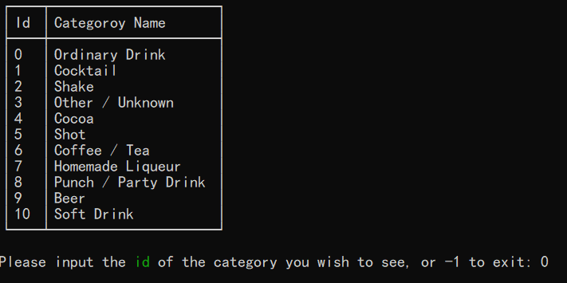
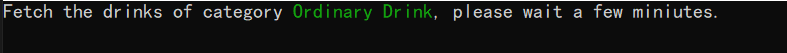
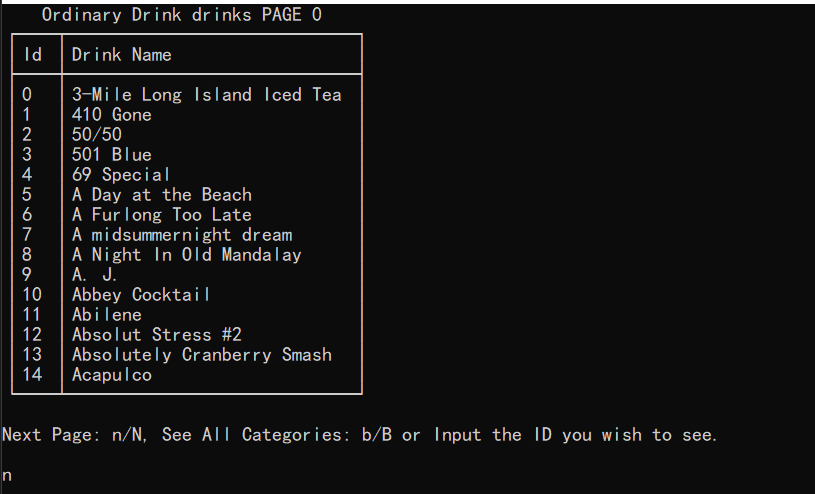
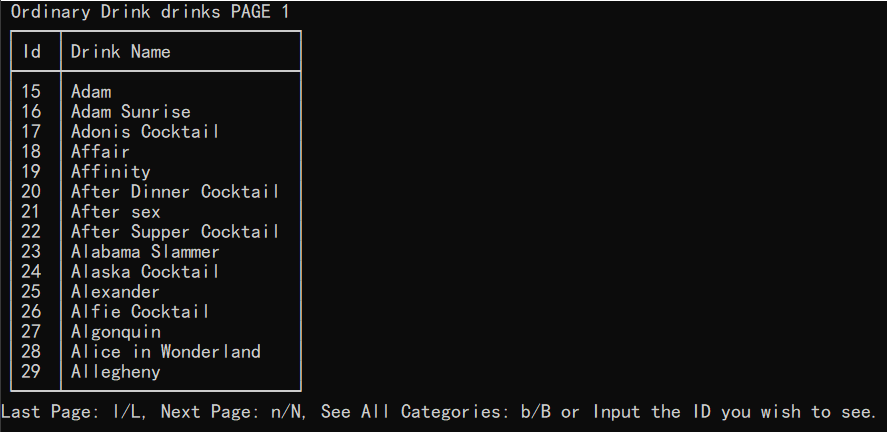
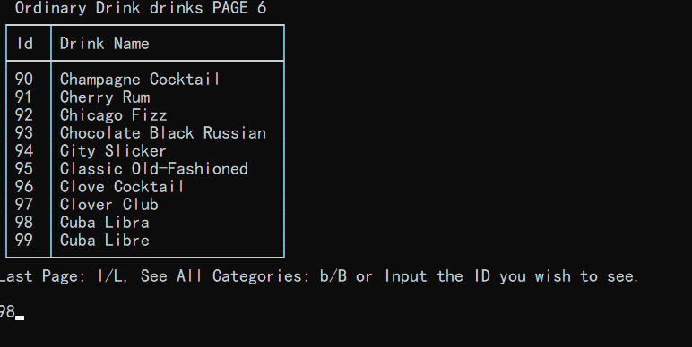

# DrinkInfo Console Applicaton

This drinkInfo console application was developed based on C#/.Net and [Spectre.Console](https://spectreconsole.net/) nuget library.
Specifically, this console application uses `System.Net.Http.HttpClient` class to fetch free datas from [TheCocktailDB](https://www.thecocktaildb.com/) and displays data using Spectre.

## Features

* Fetch data from the free web apis
* Implement a simple paging function

## Some ScreenShots

Show the categories of the drinks when application starts.

Show the prompt waiting message when the data is not returned.

Display data in pages.

Select a drink by its id and display its detail.

## Reference

* [Drink Info](https://thecsharpacademy.com/project/15)
* [Spectre.Console](https://spectreconsole.net/)
* Some posts of Stack Overflow
