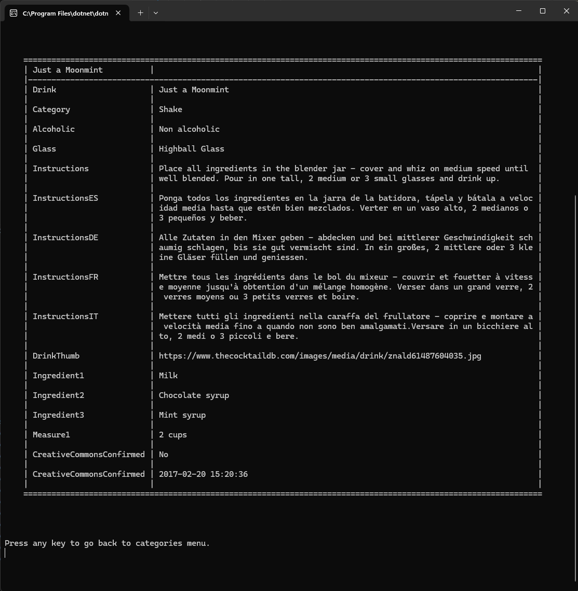

# .NET Drinks console app

This app was built by following the tutorial from C# Academy found here: [Build Drinks Information System](https://www.youtube.com/watch?v=fc7peZ-FHs4), pulling data from an external API and getting the user's input to choose drink categories and drink details.

## Resources

* An open, crowd-sourced [database of drinks and cocktails](https://www.thecocktaildb.com/api.php) from around the world.


* A Microsoft Learn [tutorial](https://docs.microsoft.com/en-us/dotnet/csharp/tutorials/console-webapiclient) that builds an app that issues HTTP requests to a REST service on GitHub. The app reads information in JSON format and converts the JSON into C# objects.


* I borrowed some code from this [Stack Overflow thread](https://stackoverflow.com/questions/23130382/split-string-by-character-count-and-store-in-string-array) to address ConsoleTableExt limitation surrounding rows with multiple lines. I used a helper function to parse a string into substrings by character length.

```
IEnumerable<string> GetNextChars ( string str, int iterateCount )
{
    var words = new List<string>();

    for ( int i = 0; i < str.Length; i += iterateCount )
        if ( str.Length - i >= iterateCount ) words.Add(str.Substring(i, iterateCount));
        else words.Add(str.Substring(i, str.Length - i));

    return words;
}
```

## Screenshots




