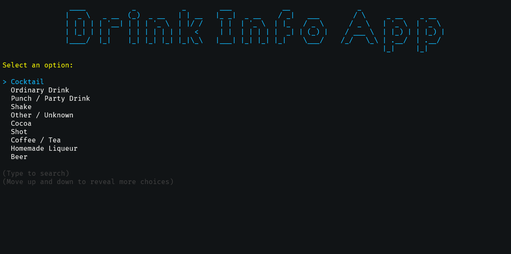

# Drink Info App

The **Drink Info App** is an interactive console application
designed to help you explore different drink categories and find details about specific drinks.

Inspired by the [C# Academy Drinks Project](https://thecsharpacademy.com/project/15/drinks).

## 📸 Overview

## Features

- **Interactive Console UI:** User-friendly selection via Spectre.Console.
- **Drink Categories:** Browse available drink categories.
- **Drink Selection:** View drinks within a selected category.
- **Detailed Drink Info:** Get information on ingredients, preparation, and other details.

## How It Works

1. **Launch the app.**
2. **Select a category** from the available drink categories.
3. **Browse drinks** within the selected category.
4. **Select a drink** to view detailed information.
5. **Exit the app** when done.

## Technologies Used

- **Spectre.Console:** For an enhanced console UI.
- **HttpClient:** Fetches drink data from an external API.
